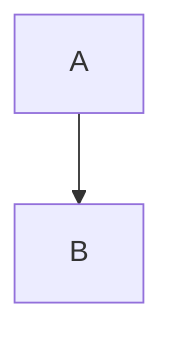

---
hide:
    - navigation
tags:
    - Special Page
title: Markup testing
---

Header
===
The table of contents is shown only if there is a first level header and second level headers.

## Inline

**Bold**
_Italic_
***BoldItalic***
<ins>Underline</ins>, ^^Underline^^
~~Strike~~
==Hilited==
:smile:
x<sup>2</sup>, x^2^
H<sub>2</sub>O, H~2~O
example.com
https://github.com
Footnote[^1]
>citation here

`#!python range()` function.
` #!python range() ` function.

<div markdown="1">
<p markdown="1">A Markdown paragraph with *no* closing tag.
<p>A raw paragraph with *no* closing tag.
</div>

## Block

```{.py linenums="42" hl_lines="6-7 9" title="factorial.py"}
# Python code to demonstrate naive method
# to compute factorial
n = 23
fact = 1
 
for i in range(1, n+1):
    fact = fact * i #(1)
 
print("The factorial of 23 is : ", end="")
print(fact)
```

1.  :man_raising_hand: I'm a code annotation! I can contain `code`, __formatted
    text__, images, ... basically anything that can be written in Markdown.

``` title="include file"
-8<- "docs/test-markup.md:1:5"
-8<- "https://raw.githubusercontent.com/github/docs/main/README.md:1:5"
```



First Header | Second Header | Third Header
:----------- |:-------------:| -----------:
Left         | Center        | :material-check-all: Right
Left         | Center        | Right

=== "Tab"
    Some text.
    Blank line is required before list:

    * one
        * two

===! "JS"

    ```js
    var a = 1;
    ```

===+ "Active tab"

    ```html
    <p>P</p>
    ```

    * One
        * Two

## Nesting

+ here must be text or just one space symbol
  ```js title=""
  var a = 1;
  function foo(){}
  ```

Line of text to separate lists, otherwise its are counted as one...

1. Item
2. Item
    1. One
    2. Two
       <pre>```
       code
       ```</pre>

Term
: Definition

> * One
  * Two
    * Three

## Admonition

???+ custom "Title text"
    foo

!!! note

!!! abstract

!!! info

!!! tip

!!! success

!!! question

!!! warning

!!! failure

!!! danger

!!! bug

!!! example inline

!!! quote inline end

<br><br>

[^1]:
    multilined
    footnote